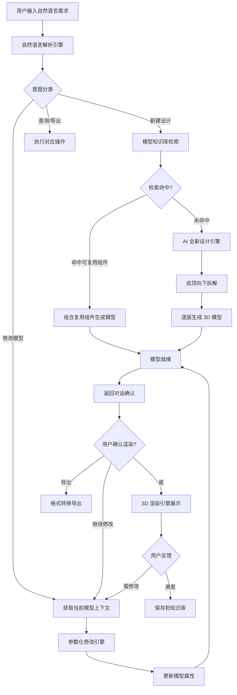
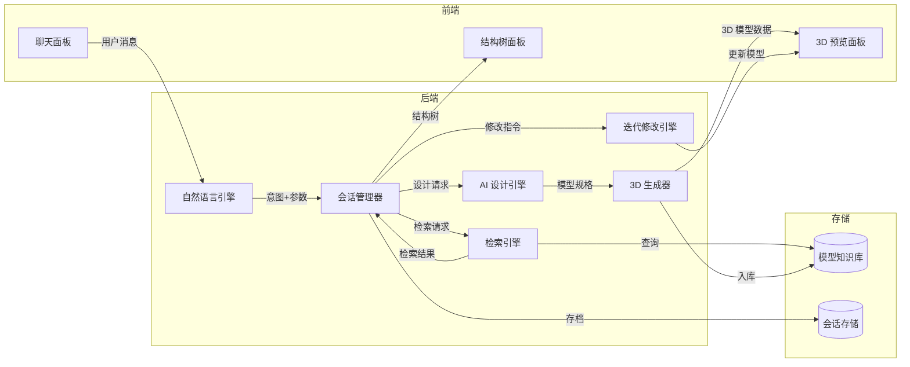

# Liuvis — AI 驱动 3D 模型设计助手 产品需求文档（PRD）

## 1. 产品概述

| 字段 | 内容 |
|------|------|
| **一句话定位** | Liuvis 是一款通过自然语言交互驱动 3D 模型设计与迭代的 AI 助手平台 |
| **目标用户** | 工业设计师、机械工程师、产品原型开发者、3D 建模从业者 |
| **核心价值主张** | 将"用自然语言描述需求 → AI 自动生成/修改 3D 模型"的完整链路闭环，将 3D 设计门槛从"掌握专业 CAD 工具"降低到"会说话就行" |
| **项目代号** | liuvis |
| **后端技术栈** | .NET Core (C#) |
| **前端技术栈** | React + Three.js / React Three Fiber + MUI + Tailwind CSS |

---

## 2. 用户故事

### 核心场景（来自蓝图）

| # | 用户故事 | 验收标准 |
|---|---------|---------|
| US-1 | 作为设计师，我想用自然语言描述一个 3D 模型需求，以便无需手动操作 CAD 工具即可启动设计 | 系统识别意图并返回确认/拆解方案，响应 < 5s |
| US-2 | 作为设计师，我想让系统自动检索是否有可复用的模型组件，以便减少重复设计工作 | 系统在生成前自动执行检索，并明确告知用户是"复用"还是"全新设计" |
| US-3 | 作为设计师，我想在对话中确认后让系统 3D 渲染展示设计结果，以便直观评审模型 | 点击确认后 3D 视图加载完成 < 3s（标准模型） |
| US-4 | 作为设计师，我想通过自然语言对已生成模型做局部修改（如配色、尺寸），以便快速迭代设计 | 修改指令后模型实时更新，视觉反馈 < 2s |
| US-5 | 作为设计师，我想在多轮对话中保持设计上下文，以便持续优化而不必重复描述 | 系统维护完整会话状态，支持 20+ 轮对话不丢失上下文 |

### 扩展场景

| # | 用户故事 | 验收标准 |
|---|---------|---------|
| US-6 | 作为工程师，我想将生成的模型导出为 NX（.prt）等工业标准格式，以便在下游 CAD/CAM 系统中继续加工 | 支持导出 STEP / IGES / NX .prt 格式 |
| US-7 | 作为团队负责人，我想将设计结果保存到项目知识库中，以便团队成员复用 | 支持模型入库，带标签/分类/版本号 |
| US-8 | 作为设计师，我想查看模型的结构树（装配层级），以便理解 AI 的设计拆解逻辑 | 展示自顶向下的部件分解树 |
| US-9 | 作为设计师，我想对模型做参数化调整（如"翼展加长 20%"），以便精确控制尺寸 | 支持数值型参数修改，修改后模型几何正确更新 |
| US-10 | 作为新用户，我想看到引导教程，以便快速了解 Liuvis 的能力和使用方式 | 首次登录展示 3 步引导流程 |

---

## 3. 功能需求池

### P0 — MVP 必须具备（跑通蓝图完整对话流程）

| 需求 ID | 功能 | 描述 |
|---------|------|------|
| F-P0-01 | 自然语言输入接口 | 用户通过聊天框输入设计需求，支持中英文 |
| F-P0-02 | 意图识别引擎 | 解析用户输入的设计意图：新建/修改/查询/导出 |
| F-P0-03 | 模型知识库检索 | 根据意图自动检索可复用模型，返回命中/未命中结果 |
| F-P0-04 | 设计策略决策 | 基于检索结果自动决策：复用已有模型 or 全新设计，并向用户说明 |
| F-P0-05 | AI 3D 模型生成 | 自顶向下拆解 + 全新设计，生成基础 3D 模型 |
| F-P0-06 | 3D 在线渲染展示 | 在浏览器中 3D 渲染展示生成结果（旋转/缩放/平移） |
| F-P0-07 | 自然语言迭代修改 | 支持对已生成模型的局部属性修改（颜色、材质） |
| F-P0-08 | 多轮对话管理 | 维护会话上下文，支持连续修改指令 |
| F-P0-09 | 对话式 UI | 聊天界面 + 3D 预览面板的左右分栏布局 |

### P1 — 重要增强

| 需求 ID | 功能 | 描述 |
|---------|------|------|
| F-P1-01 | 参数化尺寸修改 | 支持数值型参数调整（如"翼展加长 20%"） |
| F-P1-02 | 模型结构树展示 | 显示装配层级/部件分解树 |
| F-P1-03 | 模型导出（STEP/IGES） | 导出工业标准中间格式 |
| F-P1-04 | 模型知识库管理 | 上传/标签/分类/搜索已有模型 |
| F-P1-05 | 设计历史版本管理 | 保存每次修改快照，支持回退 |
| F-P1-06 | 部件替换/组合 | 选择已有组件替换当前模型的某个部件 |

### P2 — 锦上添花

| 需求 ID | 功能 | 描述 |
|---------|------|------|
| F-P2-01 | NX .prt 格式导出 | 支持 Siemens NX 原生格式 |
| F-P2-02 | 多人协同设计 | 多用户同时编辑同一模型 |
| F-P2-03 | 语音输入 | 支持语音转文字输入设计指令 |
| F-P2-04 | 新手引导教程 | 首次使用引导流程 |
| F-P2-05 | 模型分享链接 | 生成可分享的模型预览链接 |
| F-P2-06 | AI 设计建议 | 主动给出设计优化建议（如结构强度、空气动力学） |

---

## 4. 业务流程图

### 4.1 核心对话流程



### 4.2 模块间数据流



---

## 5. 模块边界划分

### 5.1 系统架构总览

```
┌─────────────────────────────────────────────────────┐
│                    前端 (React)                       │
│  ┌──────────┐  ┌──────────────┐  ┌──────────────┐  │
│  │ 聊天面板  │  │  3D 预览面板  │  │  结构树面板   │  │
│  └─────┬────┘  └──────┬───────┘  └──────┬───────┘  │
│        └──────────────┼─────────────────┘           │
│                       │ REST API / WebSocket        │
└───────────────────────┼─────────────────────────────┘
                        │
┌───────────────────────┼─────────────────────────────┐
│              后端 (.NET Core)                         │
│                       │                              │
│  ┌────────────────────▼────────────────────┐        │
│  │           API Gateway / Controller       │        │
│  └──┬─────────┬──────────┬──────────┬──────┘        │
│     │         │          │          │                 │
│  ┌──▼───┐ ┌──▼────┐ ┌──▼────┐ ┌──▼──────┐          │
│  │ NLU  │ │检索引擎│ │设计引擎│ │迭代修改  │          │
│  │Module│ │Module │ │Module │ │Module  │          │
│  └──┬───┘ └──┬────┘ └──┬────┘ └──┬──────┘          │
│     │        │         │         │                   │
│  ┌──▼────────▼─────────▼─────────▼──────┐           │
│  │          会话管理器 (Session)          │           │
│  └──┬──────────────────────────────┬────┘           │
│     │                              │                 │
│  ┌──▼──────┐               ┌───────▼──────┐         │
│  │模型知识库│               │ 3D 生成/渲染  │         │
│  │Service  │               │  Service     │         │
│  └─────────┘               └──────────────┘         │
└─────────────────────────────────────────────────────┘
         │                              │
    ┌────▼────┐                  ┌──────▼──────┐
    │Vector DB│                  │Object Store │
    │(检索存储)│                  │(模型文件)   │
    └─────────┘                  └─────────────┘
```

### 5.2 模块职责与接口定义

| 模块 | 职责 | 核心接口 | 依赖 |
|------|------|---------|------|
| **API Gateway** | 请求路由、认证、限流 | `POST /api/chat`, `GET /api/models/{id}`, `WS /ws/session` | 所有后端模块 |
| **NLU Module** | 自然语言解析、意图分类、实体抽取 | `ParseIntent(text) → IntentResult` | LLM API |
| **检索引擎** | 模型知识库检索、相似度匹配 | `SearchModel(query) → List<ModelMatch>` | Vector DB |
| **AI 设计引擎** | 设计策略决策、自顶向下拆解、设计规划 | `DesignPlan(intent) → DesignSpec` | NLU, 检索引擎 |
| **3D 生成器** | 根据 DesignSpec 生成 3D 模型数据 | `GenerateModel(spec) → Model3D` | AI 设计引擎, LLM |
| **迭代修改引擎** | 参数化修改、局部属性更新 | `ModifyModel(modelId, change) → Model3D` | 3D 生成器, 会话管理器 |
| **会话管理器** | 多轮对话状态维护、上下文管理 | `GetContext(sessionId) → SessionState` | Session DB |
| **模型知识库 Service** | 模型入库、标签、版本管理 | `SaveModel(model) → id`, `GetModel(id) → Model3D` | Object Store, Vector DB |
| **3D 渲染 Service** | 服务端预处理（LOD 生成、缩略图） | `PrepareViewport(modelId) → ViewportData` | Object Store |

### 5.3 模块启动优先级

基于 P0 需求，建议按以下顺序启动开发：

| 启动阶段 | 模块 | 说明 |
|---------|------|------|
| **Phase 1** | API Gateway + 会话管理器 | 基础骨架，所有模块的入口 |
| **Phase 1** | NLU Module | 对话的起点，集成 LLM |
| **Phase 2** | 检索引擎 + 模型知识库 | 需要先有存储层才能跑通检索 |
| **Phase 2** | AI 设计引擎 | 依赖 NLU 和检索结果 |
| **Phase 3** | 3D 生成器 | 核心产出，依赖设计引擎的 spec |
| **Phase 3** | 迭代修改引擎 | 依赖 3D 生成器和会话状态 |
| **Phase 4** | 前端完整 UI | 聊天面板 + 3D 预览联动 |

---

## 6. 非功能性需求

| 类别 | 需求 | 指标 |
|------|------|------|
| **性能** | 意图识别响应时间 | < 2s（P95） |
| **性能** | 3D 模型生成时间 | < 30s（标准复杂度） |
| **性能** | 迭代修改渲染更新 | < 2s（属性修改） |
| **性能** | 3D 预览首屏加载 | < 3s |
| **性能** | 知识库检索响应 | < 1s |
| **并发** | 系统支持并发会话数 | ≥ 100（MVP） |
| **安全** | 用户认证 | JWT Token 认证 |
| **安全** | 数据传输加密 | HTTPS + WSS |
| **安全** | 输入内容过滤 | 防注入、防恶意指令 |
| **可用性** | 系统可用性 | 99.5%（MVP） |
| **扩展性** | 模块间通信 | REST API + 事件驱动，模块可独立部署 |
| **扩展性** | LLM 提供商 | 支持切换不同 LLM 后端（OpenAI / Azure / 自部署） |
| **扩展性** | 3D 格式 | 架构支持后续添加新导出格式 |
| **数据** | 会话数据持久化 | 会话历史保存 ≥ 30 天 |
| **数据** | 模型文件存储 | 支持对象存储（MinIO / S3 兼容） |

---

## 7. UI 设计稿描述

### 7.1 主界面 — 聊天 + 3D 预览

```
┌────────────────────────────────────────────────────────────┐
│  Liuvis                              [用户头像] [设置]       │
├──────────────────────┬─────────────────────────────────────┤
│                      │                                     │
│   💬 聊天面板         │         🎲 3D 预览面板              │
│   (40% 宽度)         │         (60% 宽度)                   │
│                      │                                     │
│  ┌────────────────┐  │    ┌─────────────────────────────┐  │
│  │ Liuvis: 收到，  │  │    │                             │  │
│  │ 没有找到数据库  │  │    │      [3D 模型渲染区]         │  │
│  │ 中有合适的可复  │  │    │                             │  │
│  │ 用模型，将按照  │  │    │      支持旋转/缩放/平移      │  │
│  │ 自顶向下的设计  │  │    │      OrbitControls           │  │
│  │ 思路进行拆解和  │  │    │                             │  │
│  │ 全新设计        │  │    │                             │  │
│  └────────────────┘  │    └─────────────────────────────┘  │
│                      │                                     │
│  ┌────────────────┐  │    ┌─────────────────────────────┐  │
│  │ Liuvis: 做好了  │  │    │  📐 结构树  │  🎨 属性面板  │  │
│  │ 要帮您全息投影  │  │    │  ├ 机身    │  颜色: #fff    │  │
│  │ 出来吗？       │  │    │  ├ 左翼    │  材质: 金属    │  │
│  │ [渲染] [修改]  │  │    │  ├ 右翼    │  尺寸: --      │  │
│  └────────────────┘  │    │  └ 尾翼    │                │  │
│                      │    └─────────────────────────────┘  │
│  ┌────────────────┐  │                                     │
│  │ 输入设计需求... │  │    [📥 导出] [💾 保存] [📤 分享]   │
│  └────────────────┘  │                                     │
├──────────────────────┴─────────────────────────────────────┤
│  状态栏：会话 #001 | 模型: 单人飞行器 v1 | 上次修改: 10s前  │
└────────────────────────────────────────────────────────────┘
```

### 7.2 关键界面说明

| 界面 | 说明 |
|------|------|
| **聊天面板** | 左侧 40%，消息气泡样式，AI 消息附带操作按钮（渲染/修改/导出），支持 Markdown 渲染，底部输入框 + 发送按钮 |
| **3D 预览面板** | 右侧 60%，Three.js 渲染区，全息投影风格（深色背景 + 蓝色线框光效 + 半透明材质），OrbitControls 交互 |
| **结构树标签页** | 3D 面板下方，树形展示模型装配层级，点击节点高亮对应部件 |
| **属性面板标签页** | 3D 面板下方，显示选中部件的颜色/材质/尺寸参数，可手动编辑 |
| **底部操作栏** | 导出/保存/分享按钮 |

### 7.3 全息投影风格说明

- 背景：深色（#0a0e1a），带微弱网格线
- 模型渲染：蓝色/青色线框 + 半透明面片 + 边缘发光（Bloom 效果）
- 环境光：冷色调，模拟全息投影台
- 选中部件高亮：切换为暖色（橙/黄）发光

---

## 8. 待确认问题

| # | 问题 | 影响范围 | 建议默认值 |
|---|------|---------|-----------|
| Q-1 | LLM 提供商选择：OpenAI / Azure OpenAI / 自部署开源模型？ | NLU Module, 设计引擎 | MVP 先用 OpenAI API |
| Q-2 | 3D 模型生成的实际方式：调用外部 AI 3D 生成 API（如 Meshy/Point-E）还是基于规则/模板拼装？ | 3D 生成器 | MVP 先用模板+参数化拼装，P1 接入 AI 生成 API |
| Q-3 | 模型知识库的初始数据来源？是否需要预置一批基础模型？ | 检索引擎, 知识库 | MVP 预置 50-100 个基础组件 |
| Q-4 | 是否需要用户认证系统，还是 MVP 先做单用户？ | API Gateway | MVP 先做单用户，P1 加认证 |
| Q-5 | 导出格式优先级：STEP/IGES 哪个先做？NX .prt 是否有 SDK 可用？ | 3D 生成器 | MVP 先做 STEP，NX .prt 放 P2 |
| Q-6 | 3D 模型在浏览器端渲染还是服务端渲染后推流？ | 前端, 3D 渲染 | MVP 浏览器端 WebGL 渲染 |
| Q-7 | 迭代修改是否需要支持撤销/重做？ | 迭代修改引擎 | P1 支持，MVP 不要求 |
| Q-8 | 是否需要实时协作（多人同时编辑同一模型）？ | 会话管理器 | P2 功能，MVP 不做 |
| Q-9 | 向量数据库选型：Milvus / Qdrant / pgvector？ | 检索引擎 | MVP 用 pgvector（与 .NET 生态契合） |
| Q-10 | 前后端通信方式：纯 REST 还是 REST + WebSocket？ | API Gateway | REST + WebSocket 混合（聊天用 WS，模型操作用 REST） |

---

## 附录：术语表

| 术语 | 定义 |
|------|------|
| NLU | Natural Language Understanding，自然语言理解 |
| NX | Siemens NX，工业 CAD 软件，.prt 为其原生格式 |
| LOD | Level of Detail，多细节层次 |
| STEP | Standard for the Exchange of Product model data，工业标准交换格式 |
| IGES | Initial Graphics Exchange Specification，另一种工业标准交换格式 |
| OrbitControls | Three.js 的轨道控制器，实现 3D 场景的旋转/缩放/平移 |
