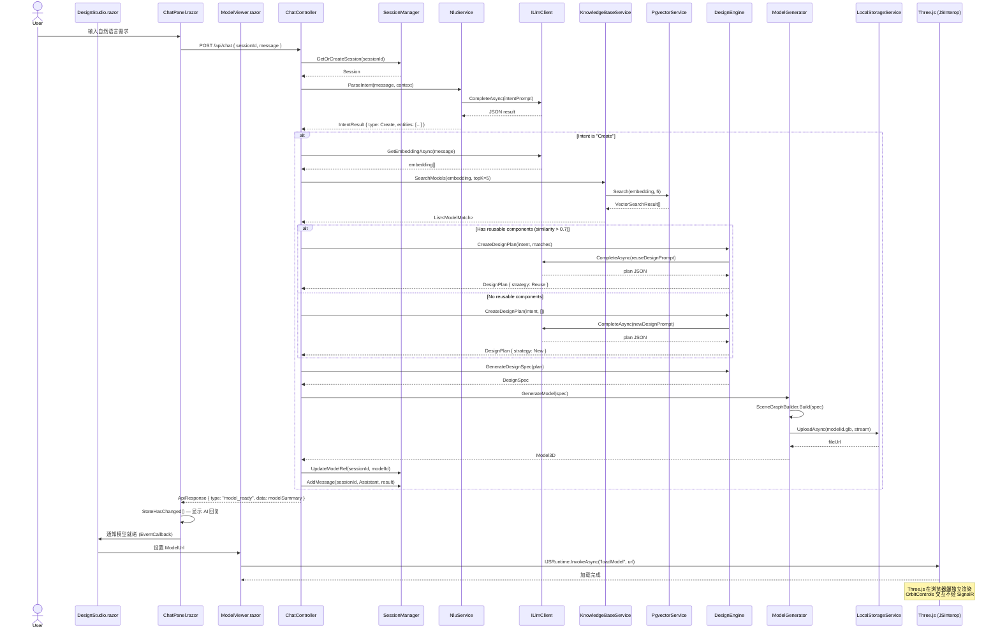
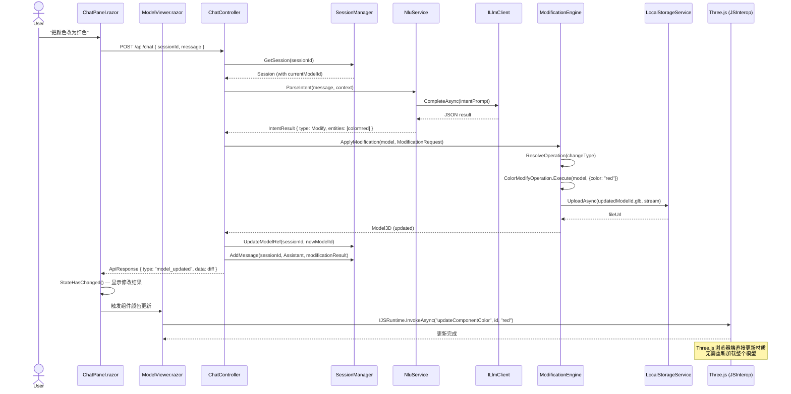
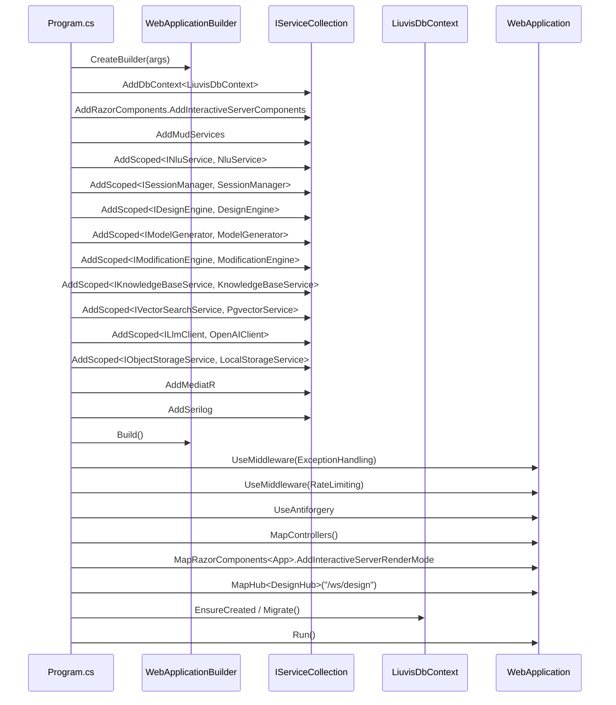

# Liuvis 系统架构设计文档

> **项目代号**: liuvis
> **架构师**: Bob
> **日期**: 2025-07
> **技术栈**: .NET 10 + Blazor Server + Three.js (JSInterop) + MudBlazor
> **基础设施**: 本地文件存储 + 本地 PostgreSQL（Phase 2+ 切换 Docker + MinIO）

---

## Part A: 系统设计

### 1. 实现方案与框架选型

#### 1.1 核心技术挑战

| 挑战 | 应对策略 |
|------|---------|
| **LLM 延迟** — 意图识别 < 2s | 流式响应 (Streaming) + 意图缓存 + Prompt 精简 |
| **3D 模型生成 < 30s** | MVP 阶段使用模板+参数化拼装（而非 AI 生成），预构建几何模板库 |
| **多轮对话上下文维护** | 会话状态持久化 + 滑动窗口上下文裁剪 + LLM Token 预算管理 |
| **检索响应 < 1s** | pgvector 索引优化 + 预计算 Embedding 缓存 |
| **修改渲染 < 2s** | 浏览器端 WebGL 增量更新（非全量重渲染）+ Blazor Server SignalR 推送 |
| **模块独立部署** | Modular Monolith 架构，模块间通过接口解耦，后期可拆为微服务 |
| **3D 交互延迟** — Blazor Server 与 JS 通信 | Three.js 交互（旋转/缩放/平移）完全在浏览器端执行，仅初始化和数据加载走 JSInterop |

#### 1.2 架构模式

**Modular Monolith**（模块化单体）+ **Blazor Server** 托管模型：

- 单一可部署单元，内部按业务领域划分为独立模块
- 前端使用 Blazor Server，UI 逻辑在服务端执行，通过内置 SignalR 通道与浏览器通信
- 模块间通过 `Liuvis.Core` 定义的接口通信，禁止模块间直接依赖
- 后期如需拆分微服务，模块可独立提取为独立服务

**Blazor Server 托管模型选型理由**：

| 维度 | Blazor Server | Blazor WebAssembly | 决策 |
|------|---------------|-------------------|------|
| **初始加载** | 极快（仅下载小型 Bootstrap 脚本） | 较慢（需下载 .NET Runtime + 程序集） | ✅ Server 优 |
| **与服务端交互** | 内置 SignalR，零配置 | 需 HttpClient / SignalR Client | ✅ Server 优 |
| **3D 渲染** | JSInterop 调用 Three.js，渲染全在浏览器 | 同样 JSInterop | ⚖️ 相同 |
| **服务器资源** | 每用户占用服务端内存 | 客户端执行，服务端无状态 | ❌ Server 劣 |
| **离线能力** | 不支持 | 支持 | ❌ Server 劣 |
| **延迟敏感度** | 每次 UI 交互都需 SignalR 往返 | 本地执行 | ❌ Server 劣 |

**结论**：选择 **Blazor Server**，理由：
1. 项目核心是 AI 驱动对话 + 3D 预览，与服务端交互频繁，Server 模式省去 API 层序列化开销
2. 3D 渲染由 Three.js 在浏览器独立执行，OrbitControls 等交互不经过 SignalR，无延迟问题
3. MVP 阶段并发需求低（≥100），Blazor Server 可胜任
4. 统一技术栈（全 C#），降低开发维护成本
5. 内置 SignalR 免去前端 WebSocket 客户端配置

**P1 演进**：如需离线或降低服务端负载，可迁移为 Blazor Web App（支持 Server + WebAssembly 混合渲染模式）

```
┌─────────────────────────────────────────────────────────┐
│              Liuvis.Web (Blazor Server Host)              │
│  ┌─────────────────────────────────────────────────────┐ │
│  │  Blazor UI 层                                        │ │
│  │  ┌──────────┐  ┌──────────────┐  ┌──────────────┐  │ │
│  │  │ 聊天面板  │  │  3D 预览面板  │  │  结构树/属性  │  │ │
│  │  │ (Razor)  │  │ (JSInterop)  │  │  (Razor)     │  │ │
│  │  └──────────┘  └──────────────┘  └──────────────┘  │ │
│  └─────────────────────────────────────────────────────┘ │
│  ┌─────────────────────────────────────────────────────┐ │
│  │  Controllers │ SignalR Circuit │ Middleware           │ │
│  └─────────────────────────────────────────────────────┘ │
└──────────────┬──────────────────────────────────────────┘
               │ 依赖注入
┌──────────────▼──────────────────────────────────────────┐
│               Liuvis.Core (Contracts)                     │
│  Entities │ Interfaces │ DTOs │ Events                    │
└──────────────┬──────────────────────────────────────────┘
               │
┌──────────────▼──────────────────────────────────────────┐
│         Business Modules (各 .csproj)                     │
│  NLU │ Session │ Design │ Generation │ ...                │
└──────────────┬──────────────────────────────────────────┘
               │
┌──────────────▼──────────────────────────────────────────┐
│           Liuvis.Infrastructure                          │
│  EF Core │ LLM Client │ pgvector │ LocalStorage           │
└─────────────────────────────────────────────────────────┘
```

#### 1.3 后端框架选型

| 组件 | 选型 | 版本 | 理由 |
|------|------|------|------|
| **运行时** | .NET | 10.0 | 新一代 LTS 版本，性能提升，原生 AOT 改进 |
| **Web 框架** | ASP.NET Core | 10.0 | 内置 SignalR、Blazor Server、中间件管道 |
| **UI 框架** | Blazor Server | 10.0 | C# 全栈开发，内置 SignalR，MVP 阶段高效 |
| **UI 组件库** | MudBlazor | 8.x | Blazor 生态最成熟的 Material Design 组件库 |
| **3D 渲染** | Three.js (JSInterop) | 0.168+ | 浏览器端 WebGL 渲染，通过 JSInterop 集成 |
| **ORM** | EF Core | 10.0 | 首选 .NET ORM，Code-First 迁移 |
| **数据库** | PostgreSQL | 16+ | 支持 pgvector 扩展，JSONB 灵活存储 |
| **向量搜索** | pgvector | 0.7+ | PostgreSQL 扩展，与主库合一，减少运维 |
| **对象存储（当前）** | 本地文件系统 | - | 零依赖，`IObjectStorageService` 接口抽象，Phase 2+ 切 MinIO |
| **对象存储（Phase 2+）** | MinIO | latest | S3 兼容，容器化部署，存 3D 模型文件 |
| **LLM SDK** | OpenAI .NET SDK | 2.x | 官方 .NET SDK，支持 Streaming |
| **实时通信** | SignalR | 内置 | Blazor Server 内置 SignalR Circuit，无需额外配置 |
| **验证** | FluentValidation | 11.x | 强类型验证规则，优于 DataAnnotation |
| **日志** | Serilog | 4.x | 结构化日志，支持 Seq/Elasticsearch Sink |
| **映射** | Mapster | 7.x | 高性能对象映射，比 AutoMapper 轻量 |
| **Mediator** | MediatR | 12.x | CQRS 中介者模式，解耦请求处理 |
| **API 文档** | Swashbuckle | 6.x | OpenAPI/Swagger 自动生成 |
| **缓存** | MemoryCache / Redis | - | MVP 用 MemoryCache，P1 切 Redis |
| **健康检查** | ASP.NET Core Health Checks | 内置 | /health 端点，容器编排就绪 |

#### 1.4 前端框架选型

| 组件 | 选型 | 版本 | 理由 |
|------|------|------|------|
| **UI 框架** | Blazor Server | 10.0 | C# 全栈，内置 SignalR，无需前后端分离 |
| **UI 组件库** | MudBlazor | 8.x | Blazor 生态最成熟的 Material Design 组件库，开箱即用 |
| **3D 渲染** | Three.js (via JSInterop) | 0.168+ | WebGL 渲染标准库，通过 IJSRuntime 调用 |
| **3D 交互** | OrbitControls (JSInterop) | Three.js 内置 | 旋转/缩放/平移，浏览器端直接执行，无 SignalR 延迟 |
| **后处理** | Three.js EffectComposer (JSInterop) | Three.js 内置 | Bloom 效果（全息投影风格） |
| **状态管理** | Blazor 原生方案 | - | CascadingParameter + EditContext + EventCallback |
| **CSS** | MudBlazor 内置 + 自定义 CSS | - | MudBlazor 主题系统 + 组件级 CSS 隔离 |
| **图标** | MudBlazor Icons | 8.x | Material Icons 内置 |
| **路由** | Blazor Router | 内置 | @page 指令，声明式路由 |

**3D 渲染集成方案（JSInterop）**：

```
┌─────────────────────────────────────────────┐
│           Blazor Component (.razor)          │
│  ┌─────────────────────────────────────────┐ │
│  │  @ref="viewerRef" <div @ref="container">│ │
│  └───────────────┬─────────────────────────┘ │
│                  │ IJSRuntime.InvokeAsync     │
│  ┌───────────────▼─────────────────────────┐ │
│  │  threeJsModule.js (ES Module)            │ │
│  │  ┌─────────────────────────────────────┐ │ │
│  │  │  initScene(container)               │ │ │ ← 初始化场景
│  │  │  loadModel(url)                     │ │ │ ← 加载 GLB 模型
│  │  │  updateComponentColor(id, color)    │ │ │ ← 修改部件颜色
│  │  │  highlightComponent(id)             │ │ │ ← 高亮部件
│  │  │  setBloomEnabled(enabled)           │ │ │ ← 全息投影效果
│  │  │  getSceneSnapshot()                 │ │ │ ← 获取当前视角
│  │  └─────────────────────────────────────┘ │ │
│  │  OrbitControls — 浏览器端直接运行        │ │ ← 不经过 JSInterop
│  │  requestAnimationFrame — 浏览器端运行    │ │ ← 不经过 JSInterop
│  └──────────────────────────────────────────┘ │
└─────────────────────────────────────────────┘
```

**关键设计**：
- Three.js 的实时交互（旋转、缩放、平移、动画循环）完全在浏览器端 JavaScript 中执行
- JSInterop 仅用于：初始化场景、加载模型数据、触发业务操作（高亮、改色等）
- 这种模式避免了 Blazor Server 的 SignalR 往返延迟对 3D 交互的影响

#### 1.5 第三方服务集成

| 服务 | 用途 | 当前阶段 | Phase 2+ 演进 |
|------|------|---------|--------------|
| **OpenAI API** | NLU 意图解析、设计规划、Embedding 生成 | 通过 `ILlmClient` 接口抽象 | 可切换为其他 LLM Provider |
| **本地文件系统** | 3D 模型文件存储（.glb, .step 等） | `LocalStorageService` 实现 `IObjectStorageService` | 切换为 `MinioStorageService` |
| **PostgreSQL** | 主数据库 + pgvector 向量检索 | 本地安装实例 | Docker 容器化部署 |

---

### 2. 文件列表及相对路径

#### 2.1 解决方案根目录

```
Liuvis/
├── Liuvis.sln
├── Directory.Build.props
├── Directory.Packages.props
├── .gitignore
├── .editorconfig
│
├── src/
│   ├── Liuvis.Web/
│   │   ├── Liuvis.Web.csproj
│   │   ├── Program.cs
│   │   ├── App.razor
│   │   ├── Routes.razor
│   │   ├── _Imports.razor
│   │   ├── appsettings.json
│   │   ├── appsettings.Development.json
│   │   │
│   │   ├── Layout/
│   │   │   ├── MainLayout.razor
│   │   │   ├── MainLayout.razor.css
│   │   │   └── StatusBar.razor
│   │   │
│   │   ├── Pages/
│   │   │   ├── DesignStudio.razor          ← 主页：聊天 + 3D 预览
│   │   │   └── DesignStudio.razor.cs
│   │   │
│   │   ├── Components/
│   │   │   ├── Chat/
│   │   │   │   ├── ChatPanel.razor
│   │   │   │   ├── ChatPanel.razor.cs
│   │   │   │   ├── ChatPanel.razor.css
│   │   │   │   ├── MessageBubble.razor
│   │   │   │   ├── MessageBubble.razor.cs
│   │   │   │   ├── ChatInput.razor
│   │   │   │   ├── ChatInput.razor.cs
│   │   │   │   └── ActionButtons.razor
│   │   │   │
│   │   │   ├── Viewer/
│   │   │   │   ├── ModelViewer.razor
│   │   │   │   ├── ModelViewer.razor.cs
│   │   │   │   └── ModelViewer.razor.css
│   │   │   │
│   │   │   └── Sidebar/
│   │   │       ├── StructureTree.razor
│   │   │       ├── StructureTree.razor.cs
│   │   │       ├── PropertyPanel.razor
│   │   │       └── PropertyPanel.razor.cs
│   │   │
│   │   ├── Shared/
│   │   │   ├── LoadingOverlay.razor
│   │   │   └── ErrorBoundary.razor
│   │   │
│   │   ├── wwwroot/
│   │   │   ├── index.html
│   │   │   ├── css/
│   │   │   │   ├── app.css
│   │   │   │   └── hologram.css
│   │   │   └── js/
│   │   │       ├── three-module.js           ← Three.js ES Module 封装
│   │   │       └── lib/
│   │   │           └── three/                ← Three.js 库文件 (npm vendor)
│   │   │
│   │   ├── Controllers/
│   │   │   ├── ChatController.cs
│   │   │   ├── ModelController.cs
│   │   │   ├── SessionController.cs
│   │   │   └── KnowledgeBaseController.cs
│   │   │
│   │   ├── Hubs/
│   │   │   └── DesignHub.cs
│   │   │
│   │   ├── Middleware/
│   │   │   ├── ExceptionHandlingMiddleware.cs
│   │   │   └── RateLimitingMiddleware.cs
│   │   │
│   │   └── Extensions/
│   │       ├── ServiceCollectionExtensions.cs
│   │       └── ApplicationBuilderExtensions.cs
│   │
│   ├── Liuvis.Core/
│   │   ├── Liuvis.Core.csproj
│   │   ├── Entities/
│   │   │   ├── Session.cs
│   │   │   ├── SessionMessage.cs
│   │   │   ├── Model3D.cs
│   │   │   ├── ModelComponent.cs
│   │   │   ├── KnowledgeEntry.cs
│   │   │   └── DesignSnapshot.cs
│   │   ├── ValueObjects/
│   │   │   ├── IntentResult.cs
│   │   │   ├── EntityExtraction.cs
│   │   │   ├── MaterialSpec.cs
│   │   │   ├── Transform3D.cs
│   │   │   ├── Vector3.cs
│   │   │   ├── DesignSpec.cs
│   │   │   ├── ComponentSpec.cs
│   │   │   ├── DesignPlan.cs
│   │   │   ├── ModelMatch.cs
│   │   │   └── ModificationRequest.cs
│   │   ├── Enums/
│   │   │   ├── IntentType.cs
│   │   │   ├── SessionStatus.cs
│   │   │   ├── MessageRole.cs
│   │   │   ├── DesignStrategy.cs
│   │   │   ├── ModelFormat.cs
│   │   │   ├── MaterialType.cs
│   │   │   └── ChangeType.cs
│   │   ├── Interfaces/
│   │   │   ├── INluService.cs
│   │   │   ├── ISessionManager.cs
│   │   │   ├── IDesignEngine.cs
│   │   │   ├── IModelGenerator.cs
│   │   │   ├── IModificationEngine.cs
│   │   │   ├── IKnowledgeBaseService.cs
│   │   │   ├── IVectorSearchService.cs
│   │   │   ├── ILlmClient.cs
│   │   │   └── IObjectStorageService.cs
│   │   ├── DTOs/
│   │   │   ├── Requests/
│   │   │   │   ├── ChatRequest.cs
│   │   │   │   ├── ModifyModelRequest.cs
│   │   │   │   └── SearchModelRequest.cs
│   │   │   └── Responses/
│   │   │       ├── ChatResponse.cs
│   │   │       ├── ModelResponse.cs
│   │   │       ├── SessionResponse.cs
│   │   │       └── ApiResponse.cs
│   │   ├── Events/
│   │   │   ├── ModelGeneratedEvent.cs
│   │   │   ├── ModelModifiedEvent.cs
│   │   │   └── IntentParsedEvent.cs
│   │   └── Exceptions/
│   │       ├── BusinessException.cs
│   │       ├── NluParseException.cs
│   │       └── ModelNotFoundException.cs
│   │
│   ├── Liuvis.NLU/
│   │   ├── Liuvis.NLU.csproj
│   │   ├── Services/
│   │   │   └── NluService.cs
│   │   ├── Models/
│   │   │   ├── NluPromptTemplate.cs
│   │   │   └── IntentClassificationResult.cs
│   │   └── PromptTemplates/
│   │       ├── intent-classification.hbs
│   │       └── entity-extraction.hbs
│   │
│   ├── Liuvis.Session/
│   │   ├── Liuvis.Session.csproj
│   │   ├── Services/
│   │   │   └── SessionManager.cs
│   │   └── Models/
│   │       └── SessionContext.cs
│   │
│   ├── Liuvis.Design/
│   │   ├── Liuvis.Design.csproj
│   │   ├── Services/
│   │   │   └── DesignEngine.cs
│   │   ├── Strategies/
│   │   │   ├── ReuseDesignStrategy.cs
│   │   │   └── NewDesignStrategy.cs
│   │   └── Models/
│   │       └── DesignStrategyResult.cs
│   │
│   ├── Liuvis.Generation/
│   │   ├── Liuvis.Generation.csproj
│   │   ├── Services/
│   │   │   └── ModelGenerator.cs
│   │   ├── Templates/
│   │   │   ├── CylinderTemplate.cs
│   │   │   ├── BoxTemplate.cs
│   │   │   ├── SphereTemplate.cs
│   │   │   └── CompositeTemplate.cs
│   │   └── Builders/
│   │       └── SceneGraphBuilder.cs
│   │
│   ├── Liuvis.Modification/
│   │   ├── Liuvis.Modification.csproj
│   │   ├── Services/
│   │   │   └── ModificationEngine.cs
│   │   └── Operations/
│   │       ├── ColorModifyOperation.cs
│   │       ├── MaterialModifyOperation.cs
│   │       └── SizeModifyOperation.cs
│   │
│   ├── Liuvis.KnowledgeBase/
│   │   ├── Liuvis.KnowledgeBase.csproj
│   │   └── Services/
│   │       └── KnowledgeBaseService.cs
│   │
│   └── Liuvis.Infrastructure/
│       ├── Liuvis.Infrastructure.csproj
│       ├── Persistence/
│       │   ├── LiuvisDbContext.cs
│       │   ├── Configurations/
│       │   │   ├── SessionConfiguration.cs
│       │   │   ├── Model3DConfiguration.cs
│       │   │   └── KnowledgeEntryConfiguration.cs
│       │   └── Migrations/
│       │       └── (EF Core auto-generated)
│       ├── Repositories/
│       │   ├── SessionRepository.cs
│       │   ├── ModelRepository.cs
│       │   └── KnowledgeEntryRepository.cs
│       ├── LLM/
│       │   ├── OpenAIClient.cs
│       │   └── LlmOptions.cs
│       ├── VectorSearch/
│       │   ├── PgvectorService.cs
│       │   └── EmbeddingService.cs
│       ├── ObjectStorage/
│       │   ├── LocalStorageService.cs
│       │   ├── LocalStorageOptions.cs
│       │   ├── MinioStorageService.cs       ← Phase 2+ 启用
│       │   └── MinioOptions.cs              ← Phase 2+ 启用
│       └── Configuration/
│           ├── AppSettings.cs
│           └── ModuleSettings.cs
│
└── tests/
    ├── Liuvis.UnitTests/
    │   ├── Liuvis.UnitTests.csproj
    │   ├── NLU/
    │   │   └── NluServiceTests.cs
    │   ├── Design/
    │   │   └── DesignEngineTests.cs
    │   ├── Generation/
    │   │   └── ModelGeneratorTests.cs
    │   └── Modification/
    │       └── ModificationEngineTests.cs
    └── Liuvis.IntegrationTests/
        ├── Liuvis.IntegrationTests.csproj
        ├── ChatFlowTests.cs
        └── KnowledgeBaseTests.cs
```

**变更说明**：
- 原 `Liuvis.Api/` → `Liuvis.Web/`（Blazor Server 宿主项目，同时包含 API Controllers 和 Razor UI）
- 原 `frontend/` 整个目录移除，前端代码整合到 `Liuvis.Web/` 中
- 新增 `Components/Chat/`、`Components/Viewer/`、`Components/Sidebar/` — Blazor Razor 组件
- 新增 `wwwroot/js/three-module.js` — Three.js JSInterop 封装
- 新增 `wwwroot/js/lib/three/` — Three.js 库文件
- 新增 `Layout/`、`Pages/`、`Shared/` — Blazor 标准目录结构
- 移除所有 `.tsx`/`.ts`/`.css`(Tailwind) 文件，改为 `.razor`/`.razor.cs`/`.razor.css`
- 移除 `docker-compose.yml` 和 `Dockerfile`（当前阶段不使用 Docker，Phase 2+ 恢复）
- 新增 `LocalStorageService.cs` 和 `LocalStorageOptions.cs`（替代 MinIO）
- 保留 `MinioStorageService.cs` 和 `MinioOptions.cs`（标注 Phase 2+ 启用）

---

### 3. 数据结构与接口（类图）

```mermaid
classDiagram
    direction TB

    class Session {
        +SessionId : Guid
        +UserId : string
        +CreatedAt : DateTime
        +UpdatedAt : DateTime
        +Status : SessionStatus
        +CurrentModelId : Guid?
        +Messages : List~SessionMessage~
        +CreateMessage(role, content) SessionMessage
        +GetContext() SessionContext
        +UpdateModelRef(modelId) void
    }

    class SessionMessage {
        +MessageId : Guid
        +SessionId : Guid
        +Role : MessageRole
        +Content : string
        +Timestamp : DateTime
        +Metadata : Dictionary~string, object~
    }

    class Model3D {
        +ModelId : Guid
        +Name : string
        +Description : string
        +Format : ModelFormat
        +FilePath : string
        +ThumbnailPath : string
        +Components : List~ModelComponent~
        +Metadata : ModelMetadata
        +CreatedAt : DateTime
        +Version : int
        +Tags : List~string~
    }

    class ModelComponent {
        +ComponentId : Guid
        +ModelId : Guid
        +Name : string
        +ParentId : Guid?
        +GeometryType : string
        +Transform : Transform3D
        +Material : MaterialSpec
        +Children : List~ModelComponent~
    }

    class KnowledgeEntry {
        +EntryId : Guid
        +ModelId : Guid
        +Embedding : float[]
        +Tags : List~string~
        +Category : string
        +Description : string
        +CreatedAt : DateTime
    }

    class DesignSnapshot {
        +SnapshotId : Guid
        +SessionId : Guid
        +ModelId : Guid
        +Spec : DesignSpec
        +CreatedAt : DateTime
        +Description : string
    }

    class IntentResult {
        +IntentType : IntentType
        +Confidence : double
        +Entities : List~EntityExtraction~
        +OriginalText : string
        +ParsedParameters : Dictionary~string, object~
    }

    class EntityExtraction {
        +Type : string
        +Value : string
        +Start : int
        +End : int
    }

    class DesignSpec {
        +SpecId : Guid
        +SessionId : Guid
        +Intent : IntentResult
        +Strategy : DesignStrategy
        +Components : List~ComponentSpec~
        +Constraints : List~string~
        +CreatedAt : DateTime
    }

    class ComponentSpec {
        +Name : string
        +Description : string
        +GeometryType : string
        +Parameters : Dictionary~string, object~
        +Material : MaterialSpec
        +Children : List~ComponentSpec~
    }

    class DesignPlan {
        +PlanId : Guid
        +Strategy : DesignStrategy
        +ReuseMatches : List~ModelMatch~
        +NewComponents : List~ComponentSpec~
        +Description : string
    }

    class ModelMatch {
        +ModelId : Guid
        +Name : string
        +Similarity : double
        +MatchedComponents : List~string~
    }

    class MaterialSpec {
        +Color : string
        +Type : MaterialType
        +Roughness : double
        +Metalness : double
        +Opacity : double
    }

    class Transform3D {
        +Position : Vector3
        +Rotation : Vector3
        +Scale : Vector3
    }

    class Vector3 {
        +X : double
        +Y : double
        +Z : double
    }

    class ModificationRequest {
        +ModelId : Guid
        +SessionId : Guid
        +ChangeType : ChangeType
        +TargetComponent : string
        +Parameters : Dictionary~string, object~
    }

    class SessionContext {
        +SessionId : Guid
        +CurrentModel : Model3D?
        +RecentMessages : List~SessionMessage~
        +CurrentSpec : DesignSpec?
    }

    %% Relationships
    Session "1" --> "*" SessionMessage : contains
    Session "1" --> "0..1" Model3D : references
    Model3D "1" --> "*" ModelComponent : contains
    ModelComponent "0..1" --> "*" ModelComponent : children
    ModelComponent *-- Transform3D : has
    ModelComponent *-- MaterialSpec : has
    Transform3D *-- Vector3 : position
    Transform3D *-- Vector3 : rotation
    Transform3D *-- Vector3 : scale
    DesignSpec "1" --> "*" ComponentSpec : contains
    DesignSpec *-- IntentResult : derived from
    ComponentSpec *-- MaterialSpec : has
    DesignPlan "1" --> "*" ModelMatch : reuses
    DesignPlan "1" --> "*" ComponentSpec : creates
    IntentResult "1" --> "*" EntityExtraction : contains
    KnowledgeEntry "1" --> "1" Model3D : indexes
    DesignSnapshot *-- DesignSpec : captures
    ModificationRequest --> Model3D : targets

    %% ---- Blazor UI 组件（新增） ----
    class ChatPanel {
        <<Blazor Component>>
        +Messages : List~ChatMessageVm~
        +IsLoading : bool
        +SessionId : Guid
        +SendMessage(text) Task
        +OnActionTriggered(action) EventCallback
    }

    class ModelViewer {
        <<Blazor Component>>
        +ModelUrl : string?
        +Components : List~ComponentVm~
        +HighlightComponentId : Guid?
        +BloomEnabled : bool
        +InitScene() Task
        +LoadModel(url) Task
        +UpdateComponentColor(id, color) Task
        +HighlightComponent(id) Task
    }

    class StructureTree {
        <<Blazor Component>>
        +RootComponent : ComponentVm?
        +SelectedId : Guid?
        +OnNodeSelected : EventCallback~Guid~
    }

    class PropertyPanel {
        <<Blazor Component>>
        +SelectedComponent : ComponentVm?
        +OnPropertyChanged : EventCallback
    }

    class DesignStudioPage {
        <<Blazor Page>>
        +SessionId : Guid
        +CurrentModel : Model3D?
        +ChatPanel : ChatPanel
        +ModelViewer : ModelViewer
        +StructureTree : StructureTree
        +PropertyPanel : PropertyPanel
    }

    class ThreeJsInterop {
        <<JSInterop Service>>
        +InitScene(containerRef) Task
        +LoadModel(url) Task
        +UpdateComponentColor(id, color) Task
        +HighlightComponent(id) Task
        +SetBloomEnabled(enabled) Task
        +DisposeAsync() Task
    }

    DesignStudioPage *-- ChatPanel : contains
    DesignStudioPage *-- ModelViewer : contains
    DesignStudioPage *-- StructureTree : contains
    DesignStudioPage *-- PropertyPanel : contains
    ModelViewer --> ThreeJsInterop : uses
    ChatPanel --> ISessionManager : calls
    ModelViewer --> IModelGenerator : calls

    %% Interfaces
    class INluService {
        <<interface>>
        +ParseIntent(text, context) Task~IntentResult~
    }

    class ISessionManager {
        <<interface>>
        +CreateSession(userId) Task~Session~
        +GetSession(sessionId) Task~Session~
        +AddMessage(sessionId, role, content) Task~SessionMessage~
        +GetContext(sessionId) Task~SessionContext~
        +UpdateModelRef(sessionId, modelId) Task
    }

    class IDesignEngine {
        <<interface>>
        +CreateDesignPlan(intent, matches) Task~DesignPlan~
        +GenerateDesignSpec(plan) Task~DesignSpec~
    }

    class IModelGenerator {
        <<interface>>
        +GenerateModel(spec) Task~Model3D~
        +GetModel(modelId) Task~Model3D~
    }

    class IModificationEngine {
        <<interface>>
        +ApplyModification(model, request) Task~Model3D~
    }

    class IKnowledgeBaseService {
        <<interface>>
        +SearchModels(query, topK) Task~List~ModelMatch~~
        +SaveModel(model) Task~Guid~
        +GetModel(modelId) Task~Model3D~
        +AddTags(modelId, tags) Task
    }

    class IVectorSearchService {
        <<interface>>
        +Search(embedding, topK) Task~List~VectorSearchResult~~
        +Upsert(id, embedding, metadata) Task
    }

    class ILlmClient {
        <<interface>>
        +CompleteAsync(prompt, options) Task~string~
        +CompleteStreamingAsync(prompt, options) IAsyncEnumerable~string~
        +GetEmbeddingAsync(text) Task~float[]~
    }

    class IObjectStorageService {
        <<interface>>
        +UploadAsync(key, stream, contentType) Task~string~
        +DownloadAsync(key) Task~Stream~
        +GetUrlAsync(key) Task~string~
        +DeleteAsync(key) Task
    }

    class LocalStorageService {
        +BasePath : string
        +UploadAsync(key, stream, contentType) Task~string~
        +DownloadAsync(key) Task~Stream~
        +GetUrlAsync(key) Task~string~
        +DeleteAsync(key) Task
    }

    class LocalStorageOptions {
        +BasePath : string
        +Provider : string
    }

    LocalStorageService ..|> IObjectStorageService : implements

    NluService ..|> INluService : implements
    SessionManager ..|> ISessionManager : implements
    DesignEngine ..|> IDesignEngine : implements
    ModelGenerator ..|> IModelGenerator : implements
    ModificationEngine ..|> IModificationEngine : implements
    KnowledgeBaseService ..|> IKnowledgeBaseService : implements
    PgvectorService ..|> IVectorSearchService : implements
    OpenAIClient ..|> ILlmClient : implements
    LocalStorageService ..|> IObjectStorageService : implements
    MinioStorageService ..|> IObjectStorageService : implements
```



---

### 4. 程序调用流程（时序图）

#### 4.1 新建设计完整流程



#### 4.2 迭代修改流程



#### 4.3 系统初始化流程



---

### 5. 待明确事项

| # | 事项 | 影响范围 | 当前假设 | 建议确认时机 |
|---|------|---------|---------|------------|
| A-1 | OpenAI API 的 Token 预算与成本控制策略 | NLU、设计引擎 | 单次请求 max_tokens=2000 | Phase 1 启动前 |
| A-2 | 3D 模板库初始模板数量与几何类型范围 | 3D 生成器 | 5 种基础几何体 + 3 种组合体 | Phase 3 启动前 |
| A-3 | 模型文件格式：MVP 仅支持 glTF/GLB 还是同时支持 STEP | 3D 生成器、前端 | MVP 仅 GLB，P1 加 STEP | Phase 3 启动前 |
| A-4 | 会话上下文窗口大小：保留最近 N 轮对话还是 Token 计数裁剪 | 会话管理器 | 最近 20 轮消息 | Phase 1 开发中 |
| A-5 | ~~MinIO 部署方式~~ → 本地文件存储路径策略与备份 | 基础设施 | 当前用 `./data/models`，Phase 2+ 切 MinIO | Phase 1 启动前 |
| A-6 | 用户认证方案：MVP 是否需要基础 JWT 还是完全跳过 | API Gateway | MVP 跳过认证，P1 加 JWT | Phase 1 启动前 |
| A-7 | LLM Prompt 版本管理策略 | NLU、设计引擎 | 硬编码在 .hbs 文件中，随代码版本管理 | Phase 2 开发中 |
| A-8 | 模型知识库预置数据的来源与格式 | 检索引擎 | 人工整理 JSON + Embedding 预计算脚本 | Phase 2 启动前 |
| A-9 | **Blazor Server Circuit 断线重连策略** | 前端 | 使用 Blazor 内置自动重连，3D 状态通过 URL 恢复 | Phase 1 开发中 |
| A-10 | **Blazor Server 并发上限**（默认每 Circuit 约 10KB 内存） | 部署 | MVP 100 并发 ≈ 1MB 内存，可接受 | Phase 1 启动前 |
| A-11 | **Three.js 库文件分发方式**：npm vendor 拷贝 vs CDN vs npm + bundler | 前端 | wwwroot/js/lib/three/ 本地拷贝（可控、离线可用） | Phase 1 开发中 |
| A-12 | **本地 PostgreSQL 安装与 pgvector 扩展配置**：开发环境如何统一 | 基础设施 | 本地安装 PostgreSQL 16+ + 手动启用 pgvector 扩展 | Phase 1 启动前 |

---

## Part B: 任务分解

### 6. 依赖包列表

#### 6.1 后端 NuGet 包

```
# Web 框架
Microsoft.AspNetCore.App 10.0                         - ASP.NET Core 框架引用（含 Blazor Server）

# Blazor UI
MudBlazor 8.x                                         - Material Design Blazor 组件库

# ORM & 数据库
Microsoft.EntityFrameworkCore 10.0                    - ORM 核心
Npgsql.EntityFrameworkCore.PostgreSQL 10.0            - PostgreSQL Provider
Npgsql.EntityFrameworkCore.PostgreSQL.NodaTime 10.0   - NodaTime 支持

# 向量搜索
Npgsql.pgvector 0.7+                                  - pgvector .NET 绑定

# LLM
OpenAI 2.x                                            - OpenAI 官方 .NET SDK

# 实时通信
Microsoft.AspNetCore.SignalR.Core                     - SignalR（框架内置，Blazor Server 使用）

# 对象存储
Minio 6.x                                             - MinIO .NET SDK（Phase 2+ 启用，当前阶段不需要）

# 架构 & 工具
MediatR 12.x                                          - 中介者模式
FluentValidation.DependencyInjectionExtensions 11.x   - 验证框架
Mapster 7.x                                           - 对象映射
Serilog.AspNetCore 8.x                                - 结构化日志
Serilog.Sinks.Console                                 - 控制台日志输出
Serilog.Sinks.File                                    - 文件日志输出

# API 文档
Swashbuckle.AspNetCore 6.x                           - Swagger/OpenAPI

# 测试
xunit 2.x                                             - 测试框架
Moq 4.x                                               - Mock 框架
FluentAssertions 7.x                                  - 断言库
bunit 1.x                                             - Blazor 组件测试库
Microsoft.AspNetCore.Mvc.Testing 10.0                  - 集成测试
```

#### 6.2 前端 JavaScript 依赖（wwwroot/js/lib/）

```
# 3D 渲染（通过 npm vendor 拷贝至 wwwroot/js/lib/three/）
three@^0.168                   - 3D WebGL 渲染引擎
```

**说明**：Blazor 项目不再有独立的 npm 前端项目。Three.js 库文件通过以下方式管理：
1. 开发时通过 `npm install three` 下载
2. 将 `node_modules/three/` 的必要文件拷贝到 `wwwroot/js/lib/three/`
3. 封装 ES Module 入口 `wwwroot/js/three-module.js`
4. 可选：后续通过构建脚本自动化此流程

#### 6.3 基础设施依赖

**当前阶段（本地开发部署）**：

| 依赖 | 版本 | 用途 |
|------|------|------|
| PostgreSQL | 16+ | 主数据库 + pgvector（本地安装） |
| pgvector 扩展 | 0.7+ | 向量相似度搜索（PostgreSQL 扩展，手动安装） |
| Node.js | 20 LTS | Three.js 库文件下载（仅开发时） |
| .NET SDK | 10.0 | 后端 + 前端构建运行 |
| 本地磁盘 | - | 3D 模型文件存储（`./data/models`） |

**Phase 2+（容器化部署）**：

| 依赖 | 版本 | 用途 |
|------|------|------|
| Docker | 24+ | 容器化部署 |
| Docker Compose | 2.x | 环境编排（PostgreSQL + MinIO） |
| MinIO | latest | S3 兼容对象存储 |

**变更说明**：
- 移除 `pnpm`（不再有独立前端项目）
- Node.js 仅在开发阶段用于下载 Three.js 库文件，运行时不需要
- 当前阶段不使用 Docker，PostgreSQL 本地安装，文件存储使用本地磁盘
- Phase 2+ 引入 Docker Compose 统一编排，MinIO 替代本地文件存储

---

### 7. 任务列表（按依赖排序）

| Task ID | 任务名称 | 涉及文件 | 依赖 | 优先级 | 说明 |
|---------|---------|---------|------|--------|------|
| **T01** | 项目基础设施 | Liuvis.sln, Directory.Build.props, Directory.Packages.props, .gitignore, .editorconfig, **所有 .csproj**, src/Liuvis.Web/Program.cs, src/Liuvis.Web/App.razor, src/Liuvis.Web/Routes.razor, src/Liuvis.Web/_Imports.razor, src/Liuvis.Web/appsettings.json, src/Liuvis.Web/appsettings.Development.json, src/Liuvis.Web/Extensions/ServiceCollectionExtensions.cs, src/Liuvis.Web/Extensions/ApplicationBuilderExtensions.cs, src/Liuvis.Web/wwwroot/index.html, src/Liuvis.Web/wwwroot/css/app.css, src/Liuvis.Web/wwwroot/js/three-module.js | 无 | P0 | 所有解决方案结构、项目引用、依赖声明、入口文件、配置文件、MudBlazor 主题、Three.js JSInterop 骨架、本地文件存储目录。完成后可 `dotnet build` + `dotnet run` |
| **T02** | 领域模型 + 数据访问 + 基础设施 | src/Liuvis.Core/**（Entities/, ValueObjects/, Enums/, Interfaces/, DTOs/, Events/, Exceptions/）, src/Liuvis.Infrastructure/Persistence/**（DbContext, Configurations, Migrations）, src/Liuvis.Infrastructure/Repositories/**, src/Liuvis.Infrastructure/LLM/**, src/Liuvis.Infrastructure/VectorSearch/**, src/Liuvis.Infrastructure/ObjectStorage/**, src/Liuvis.Infrastructure/Configuration/** | T01 | P0 | 全部领域模型定义、接口契约、DTO、EF Core 数据层、外部服务客户端实现 |
| **T03** | 核心业务模块（NLU + 会话 + Blazor UI 骨架） | src/Liuvis.NLU/**, src/Liuvis.Session/**, src/Liuvis.Web/Controllers/**, src/Liuvis.Web/Hubs/DesignHub.cs, src/Liuvis.Web/Middleware/**, src/Liuvis.Web/Layout/**, src/Liuvis.Web/Pages/DesignStudio.razor*, src/Liuvis.Web/Components/Chat/ChatPanel.razor*, src/Liuvis.Web/Components/Viewer/ModelViewer.razor*, tests/Liuvis.UnitTests/NLU/** | T01, T02 | P0 | Phase 1 核心骨架：意图识别、会话管理、Blazor 页面 + 聊天面板 + 3D 预览组件、REST 接口层 |
| **T04** | AI 设计 + 3D 生成 + 修改 + 知识库 | src/Liuvis.Design/**, src/Liuvis.Generation/**, src/Liuvis.Modification/**, src/Liuvis.KnowledgeBase/**, src/Liuvis.Web/Components/Sidebar/StructureTree.razor*, src/Liuvis.Web/Components/Sidebar/PropertyPanel.razor*, src/Liuvis.Web/wwwroot/js/three-module.js (完善), tests/Liuvis.UnitTests/Design/**, tests/Liuvis.UnitTests/Generation/**, tests/Liuvis.UnitTests/Modification/** | T01, T02 | P1 | Phase 2-3 核心能力：设计引擎、3D 模型生成、迭代修改、知识库检索、结构树/属性面板、Three.js JSInterop 完整实现 |
| **T05** | 全链路集成 + UI 完善 | src/Liuvis.Web/Components/** (样式完善), src/Liuvis.Web/wwwroot/css/hologram.css, src/Liuvis.Web/Shared/**, tests/Liuvis.IntegrationTests/** | T01, T03, T04 | P1 | 全息投影风格 CSS、错误边界、加载状态、端到端集成测试 |

#### 任务详细说明

##### T01: 项目基础设施

**目标**：搭建可编译、可运行的项目骨架，所有项目引用和依赖就绪。

**具体内容**：
- 创建 .NET Solution 及所有 .csproj 项目（9 个源项目 + 2 个测试项目）
- 配置 `Directory.Build.props` 统一版本管理（TargetFramework = net10.0）
- 配置 `Directory.Packages.props` Central Package Management
- 编写 `Program.cs` 最小启动代码（DI 注册 + MudBlazor + Blazor Server + 中间件 + MapControllers）
- 编写 `App.razor`、`Routes.razor`、`_Imports.razor` Blazor 基础文件
- 编写 `appsettings.json` 配置模板（数据库连接、OpenAI Key 占位、本地存储路径配置）
- 配置 `ServiceCollectionExtensions` 和 `ApplicationBuilderExtensions` 预留扩展点
- 创建 `wwwroot/` 基础文件（index.html, app.css, three-module.js 骨架）
- 配置 MudBlazor 主题和字体
- 拷贝 Three.js 库文件到 `wwwroot/js/lib/three/`
- 创建本地存储目录 `./data/models`（.gitignore 排除）
- 配置 `appsettings.Development.json` 开发环境连接字符串

**验收标准**：
- `dotnet build` 成功
- 本地 PostgreSQL 实例可连接（需预先安装）
- `dotnet run` 可启动 Blazor Server（浏览器可访问，显示 MudBlazor 默认页面）
- Three.js JSInterop 骨架可调用（`initScene` 不报错）
- `./data/models` 目录存在，`LocalStorageService` 可写入测试文件

---

##### T02: 领域模型 + 数据访问 + 基础设施

**目标**：定义全部领域模型、接口契约、数据库映射、外部服务客户端。

**具体内容**：
- **Liuvis.Core**: 所有实体（Session, SessionMessage, Model3D, ModelComponent, KnowledgeEntry, DesignSnapshot）、值对象（IntentResult, DesignSpec, ComponentSpec, MaterialSpec, Transform3D, Vector3, ModelMatch, ModificationRequest, DesignPlan, EntityExtraction）、枚举、接口（9 个核心接口）、DTO（Request/Response）、事件、异常
- **Liuvis.Infrastructure**: LiuvisDbContext（含 pgvector 配置）、EF Configurations、Repositories、OpenAIClient（ILlmClient 实现）、PgvectorService（IVectorSearchService 实现）、LocalStorageService（IObjectStorageService 实现，基于本地文件系统）、MinioStorageService（IObjectStorageService 实现，Phase 2+ 启用）、EmbeddingService、配置类（AppSettings, ModuleSettings, LocalStorageOptions）
- 生成初始 EF Core Migration

**验收标准**：
- `dotnet build` 成功
- `dotnet ef migrations add Init` 成功
- `dotnet ef database update` 可创建数据库表
- OpenAIClient 可调用 OpenAI API（需配置 API Key）
- PgvectorService 可执行向量搜索

---

##### T03: 核心业务模块（NLU + 会话 + Blazor UI 骨架）

**目标**：实现 Phase 1 核心骨架 — 意图识别 + 会话管理 + Blazor 页面基础组件。

**具体内容**：
- **Liuvis.NLU**: NluService（调用 ILlmClient 解析意图 + 提取实体）、Prompt 模板、IntentClassificationResult
- **Liuvis.Session**: SessionManager（会话 CRUD + 上下文管理）、SessionContext
- **Liuvis.Web/Layout**: MainLayout（MudBlazor 布局：顶部工具栏 + 主内容区 + 状态栏）、StatusBar
- **Liuvis.Web/Pages**: DesignStudio（主页：左右分栏，ChatPanel + ModelViewer）
- **Liuvis.Web/Components/Chat**: ChatPanel（MudBlazor 卡片 + 消息列表 + 输入框）、MessageBubble（MudAvator + MudText）、ChatInput（MudTextField + MudButton）、ActionButtons（MudButtonGroup）
- **Liuvis.Web/Components/Viewer**: ModelViewer（div 容器 + JSInterop 初始化 Three.js 场景）
- **Liuvis.Web/Controllers**: ChatController（POST /api/chat）、ModelController（GET /api/models/{id}）、SessionController（POST /api/sessions, GET /api/sessions/{id}）、KnowledgeBaseController（POST /api/kb/search）
- **Liuvis.Web/Hubs**: DesignHub（SignalR Hub，推送模型状态变更）
- **Liuvis.Web/Middleware**: ExceptionHandlingMiddleware（全局异常捕获）、RateLimitingMiddleware（简单限流）
- **Unit Tests**: NluService 单元测试

**验收标准**：
- 浏览器访问 `/` 显示 DesignStudio 页面（MudBlazor 布局正确）
- 聊天面板可输入消息并显示 AI 回复（意图解析正常）
- 3D 预览面板可初始化 Three.js 场景（深色背景 + 网格线）
- POST /api/chat 可解析意图并返回 IntentResult
- 会话创建、消息添加、上下文获取正常工作
- 异常中间件正确捕获并返回标准错误格式
- NLU 单元测试通过

---

##### T04: AI 设计 + 3D 生成 + 修改 + 知识库

**目标**：实现 Phase 2-3 核心能力 — 从意图到 3D 模型产出的完整闭环。

**具体内容**：
- **Liuvis.Design**: DesignEngine（设计规划 + 规格生成）、ReuseDesignStrategy（复用策略）、NewDesignStrategy（全新设计策略）、DesignStrategyResult
- **Liuvis.Generation**: ModelGenerator（基于 DesignSpec 生成 3D 模型）、几何模板（CylinderTemplate, BoxTemplate, SphereTemplate, CompositeTemplate）、SceneGraphBuilder（组装场景图）
- **Liuvis.Modification**: ModificationEngine（分派修改操作）、ColorModifyOperation、MaterialModifyOperation、SizeModifyOperation
- **Liuvis.KnowledgeBase**: KnowledgeBaseService（检索 + 入库 + 标签管理）
- **Liuvis.Web/Components/Sidebar**: StructureTree（MudTreeView 展示装配层级）、PropertyPanel（MudForm + MudTextField/MudSelect 编辑属性）
- **Liuvis.Web/wwwroot/js/three-module.js**: 完善 JSInterop（loadModel, updateComponentColor, highlightComponent, setBloomEnabled, getSceneSnapshot）
- **Unit Tests**: 设计引擎、3D 生成器、修改引擎单元测试

**验收标准**：
- 给定 IntentResult，DesignEngine 可生成 DesignPlan 和 DesignSpec
- ModelGenerator 可根据 DesignSpec 生成 Model3D（GLB 格式）
- ModificationEngine 可对 Model3D 执行颜色/材质/尺寸修改
- KnowledgeBaseService 可检索相似模型并返回 ModelMatch
- StructureTree 可展示模型装配层级，点击节点高亮对应部件
- PropertyPanel 可展示并编辑部件属性
- Three.js JSInterop 可加载 GLB 模型、更新颜色、高亮部件
- 所有单元测试通过

---

##### T05: 全链路集成 + UI 完善

**目标**：完善 UI 细节、全息投影风格，完成端到端集成测试。

**具体内容**：
- **全息投影风格 CSS**: `wwwroot/css/hologram.css`（深色背景 #0a0e1a + 网格线 + 蓝色线框 + Bloom 后处理）
- **MudBlazor 主题定制**: 深色主题配置，匹配全息投影风格
- **组件样式完善**: 所有 Razor 组件的 `.razor.css` 作用域样式
- **Shared 组件**: LoadingOverlay（MudProgressCircular）、ErrorBoundary（MudAlert）
- **全链路集成测试**: 完整对话流程端到端测试（bUnit + WebApplicationFactory）

**验收标准**：
- 聊天面板可发送消息并显示 AI 回复（MudBlazor 组件风格统一）
- 3D 预览面板可加载并渲染 GLB 模型（旋转/缩放/平移）
- 全息投影风格（深色背景 + 蓝色线框 + Bloom 效果）
- 迭代修改后模型实时更新（JSInterop 增量更新）
- 结构树和属性面板可展示模型信息
- 端到端集成测试通过

---

### 8. 共享知识（跨文件约定）

#### 8.1 项目命名规范

| 类别 | 规范 | 示例 |
|------|------|------|
| 项目名 | PascalCase，Liuvis 前缀 | `Liuvis.Web`, `Liuvis.NLU`, `Liuvis.Infrastructure` |
| 类名 | PascalCase | `NluService`, `Model3D` |
| 接口名 | I 前缀 + PascalCase | `INluService`, `ILlmClient` |
| 方法名 | PascalCase | `ParseIntent()`, `GenerateModel()` |
| 私有字段 | _camelCase | `_llmClient`, `_dbContext` |
| 参数/局部变量 | camelCase | `sessionId`, `intentResult` |
| 常量 | PascalCase | `MaxRetryCount` |
| 枚举 | PascalCase（单数） | `IntentType`, `ModelFormat` |
| DTO | XRequest / XResponse | `ChatRequest`, `ModelResponse` |
| 文件名 | 与类名一致 | `NluService.cs` |
| Razor 组件 | PascalCase | `ChatPanel.razor`, `ModelViewer.razor` |
| Razor 代码隐藏 | 组件名.razor.cs | `ChatPanel.razor.cs` |
| Razor 样式 | 组件名.razor.css | `ChatPanel.razor.css` |
| JS 模块 | kebab-case | `three-module.js` |
| 页面路由 | kebab-case | `@page "/design-studio"` |

#### 8.2 API 设计规范

```
# REST 端点（供外部集成或 Blazor HttpClient 使用）
POST   /api/chat                    - 发送聊天消息
GET    /api/models/{id}             - 获取模型详情
GET    /api/models/{id}/download    - 下载模型文件
POST   /api/sessions                - 创建会话
GET    /api/sessions/{id}           - 获取会话
POST   /api/kb/search               - 搜索知识库
POST   /api/kb/models               - 保存模型到知识库

# Blazor Server 内部调用
Blazor 组件可直接注入 Service（ISessionManager, INluService 等）
无需经过 HTTP API，减少序列化开销
仅对外暴露或跨域场景使用 REST API

# WebSocket (SignalR)
/ws/design                           - 设计协作 Hub
  → ModelReady(model)               - 模型生成完成
  → ModelUpdated(diff)              - 模型修改更新
  → IntentParsed(intent)            - 意图解析完成（流式）

# JSInterop 接口（wwwroot/js/three-module.js）
initScene(containerId)              - 初始化 Three.js 场景
loadModel(glbUrl)                   - 加载 GLB 模型
updateComponentColor(componentId, color) - 更新部件颜色
highlightComponent(componentId)     - 高亮部件
setBloomEnabled(enabled)            - 开关 Bloom 效果
getSceneSnapshot()                  - 获取当前视角快照
dispose()                           - 销毁场景
```

**统一响应格式**：
```json
{
  "code": 200,
  "data": { ... },
  "message": "success"
}
```

**错误响应格式**：
```json
{
  "code": 400,
  "data": null,
  "message": "Intent parsing failed: empty input"
}
```

#### 8.3 错误处理策略

| 层级 | 策略 |
|------|------|
| **领域层** | 抛出领域异常（`BusinessException`, `NluParseException`, `ModelNotFoundException`） |
| **应用层** | MediatR Pipeline Behavior 捕获异常，记录日志 |
| **API 层** | `ExceptionHandlingMiddleware` 统一转换为标准 ApiResponse |
| **Blazor UI 层** | ErrorBoundary 组件兜底 + MudSnackbar 显示错误通知 |
| **JSInterop 层** | try/catch 包裹 JS 调用，失败时回退到 C# 侧错误处理 |

**错误码规范**：
- `4xx`：客户端错误（400 参数错误, 404 未找到, 429 限流）
- `5xx`：服务端错误（500 内部错误, 502 LLM 不可用, 503 存储不可用）

#### 8.4 日志规范

```csharp
// 使用 Serilog 结构化日志
_logger.LogInformation("Intent parsed: {IntentType} with confidence {Confidence} for session {SessionId}",
    intent.IntentType, intent.Confidence, sessionId);

_logger.LogError(ex, "LLM call failed for session {SessionId}, retry {RetryCount}", sessionId, retryCount);
```

**日志级别**：
- `Debug`：方法入参/出参
- `Information`：业务关键事件（意图解析、模型生成、修改完成）
- `Warning`：可恢复的异常（LLM 超时重试、检索无结果）
- `Error`：不可恢复异常

#### 8.5 Blazor 编码规范

```csharp
// 组件状态管理：使用 @code 块或 .razor.cs 代码隐藏
// 简单组件用 @code，复杂组件用 .razor.cs
@code {
    private List<ChatMessageVm> _messages = new();
    private bool _isLoading = false;
    
    // 异步操作后自动触发重新渲染
    private async Task SendMessage(string text)
    {
        _isLoading = true;
        var result = await _nluService.ParseIntent(text, context);
        _messages.Add(new ChatMessageVm(result));
        _isLoading = false;
        // StateHasChanged() 在 async 方法后自动调用
    }
}

// 跨组件通信：使用 EventCallback
[Parameter] public EventCallback<Model3D> OnModelReady { get; set; }

// 共享状态：使用 CascadingParameter 或 Scoped Service
[CascadingParameter] public SessionState SessionState { get; set; }

// JSInterop 调用模式
private IJSObjectReference? _module;

protected override async Task OnAfterRenderAsync(bool firstRender)
{
    if (firstRender)
    {
        _module = await JS.InvokeAsync<IJSObjectReference>("import", "./js/three-module.js");
        await _module.InvokeVoidAsync("initScene", _containerRef);
    }
}

public async ValueTask DisposeAsync()
{
    if (_module is not null)
    {
        await _module.InvokeVoidAsync("dispose");
        await _module.DisposeAsync();
    }
}
```

#### 8.6 配置管理策略

```json
// appsettings.json 结构
{
  "ConnectionStrings": {
    "DefaultConnection": "Host=localhost;Port=5432;Database=liuvis;Username=liuvis;Password=..."
  },
  "OpenAI": {
    "ApiKey": "",           // 环境变量覆盖
    "Model": "gpt-4o",
    "EmbeddingModel": "text-embedding-3-small",
    "MaxTokens": 2000
  },
  "Storage": {
    "Provider": "Local",             // "Local" | "MinIO" — 切换实现
    "BasePath": "./data/models",     // LocalStorage 专用
    "MinIO": {                       // Phase 2+ 启用
      "Endpoint": "localhost:9000",
      "AccessKey": "minioadmin",
      "SecretKey": "minioadmin",
      "BucketName": "liuvis-models"
    }
  },
  "Session": {
    "MaxContextRounds": 20,
    "SessionTimeoutMinutes": 60
  },
  "MudBlazor": {
    "Theme": "Dark"
  }
}
```

**敏感配置**：通过环境变量注入，不写入 appsettings.json：
- `LIUVIS_OPENAI_APIKEY`
- `LIUVIS_DB_PASSWORD`
- `LIUVIS_MINIO_SECRETKEY`（Phase 2+）

#### 8.7 配置切换约定（DI 注册模式）

所有外部依赖通过接口抽象，当前阶段用最简实现，后期通过修改 DI 注册切换实现：

```csharp
// ServiceCollectionExtensions.cs — 存储 Provider 切换示例
var storageProvider = builder.Configuration.GetValue<string>("Storage:Provider");

switch (storageProvider?.ToLowerInvariant())
{
    case "minio":
        builder.Services.AddScoped<IObjectStorageService, MinioStorageService>();
        builder.Services.Configure<MinioOptions>(builder.Configuration.GetSection("Storage:MinIO"));
        break;
    case "local":
    default:
        builder.Services.AddScoped<IObjectStorageService, LocalStorageService>();
        builder.Services.Configure<LocalStorageOptions>(builder.Configuration.GetSection("Storage"));
        break;
}

// 同样模式适用于其他外部依赖：
// - ILlmClient：当前 OpenAIClient，可切换为其他 LLM Provider
// - IVectorSearchService：当前 PgvectorService，可切换为其他向量引擎
// - 缓存：当前 MemoryCache，Phase 2+ 可切换为 Redis
```

**切换原则**：
1. 接口定义在 `Liuvis.Core` 中，不依赖具体实现
2. 实现类在 `Liuvis.Infrastructure` 中，各自独立
3. DI 注册集中在 `ServiceCollectionExtensions.cs`，一处修改即可切换
4. 配置项通过 `appsettings.json` 的 `Provider` 字段控制，无需改代码

---

### 9. 任务依赖图

```mermaid
graph TD
    T01[T01: 项目基础设施<br/>P0 | 无依赖]
    T02[T02: 领域模型 + 数据层 + 基础设施<br/>P0 | 依赖 T01]
    T03[T03: NLU + 会话 + Blazor UI 骨架<br/>P0 | 依赖 T01, T02]
    T04[T04: AI 设计 + 3D 生成 + 修改 + 知识库<br/>P1 | 依赖 T01, T02]
    T05[T05: 全链路集成 + UI 完善<br/>P1 | 依赖 T01, T03, T04]

    T01 --> T02
    T01 --> T03
    T02 --> T03
    T02 --> T04
    T01 --> T05
    T03 --> T05
    T04 --> T05

    style T01 fill:#e74c3c,color:#fff,stroke:#c0392b
    style T02 fill:#e67e22,color:#fff,stroke:#d35400
    style T03 fill:#2ecc71,color:#fff,stroke:#27ae60
    style T04 fill:#3498db,color:#fff,stroke:#2980b9
    style T05 fill:#9b59b6,color:#fff,stroke:#8e44ad
```

**启动路径说明**：
- **可立即启动**：T01（基础设施） → 无任何阻塞
- **第二批**：T02（领域层） → T01 完成后立即启动
- **第三批**：T03 + T04 可并行 → T02 完成后同时启动
- **最后**：T05（集成 + UI 完善） → T03 和 T04 完成后启动

**Phase 映射**：
- **Phase 1** = T01 + T02 + T03（基础骨架 + 核心对话能力 + Blazor UI）
- **Phase 2** = T04（AI 设计 + 3D 生成 + 知识库）
- **Phase 3** = T05（全链路集成 + 全息投影风格 + 端到端测试）
